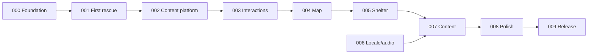

# Product backlog

## Operating model

The backlog is ordered by dependency and player-visible risk. Epic numbers express intended delivery order, not permanent component ownership. Stories use `E<epic>-S<story>` identifiers.

Status values:

- **Planned** — specified but not started
- **In progress** — active implementation
- **Blocked** — dependency or decision missing
- **Done** — acceptance criteria and epic gate pass

## Epic index

| Epic                                                                 | Milestone | Target version | Outcome                                              | Depends on | Status  |
| -------------------------------------------------------------------- | --------: | -------------: | ---------------------------------------------------- | ---------- | ------- |
| [EPIC-000](epics/EPIC-000-foundation.md)                             |        M0 |        `0.1.0` | Reproducible repository and quality baseline         | —          | Done    |
| [EPIC-001](epics/EPIC-001-first-rescue-vertical-slice.md)            |        M1 |        `0.2.0` | Complete kitten rescue from map to persisted shelter | 000        | Done    |
| [EPIC-002](epics/EPIC-002-content-platform.md)                       |        M2 |        `0.3.0` | Validated declarative content packs                  | 001        | Planned |
| [EPIC-003](epics/EPIC-003-interaction-and-guidance-engine.md)        |        M3 |        `0.4.0` | All five reusable interactions and hinting           | 001, 002   | Planned |
| [EPIC-004](epics/EPIC-004-map-and-progression.md)                    |        M4 |        `0.5.0` | Full map, unlock rules, replay                       | 002, 003   | Planned |
| [EPIC-005](epics/EPIC-005-shelter-and-persistence.md)                |        M5 |        `0.6.0` | Three-area living shelter and robust saves           | 002, 004   | Planned |
| [EPIC-006](epics/EPIC-006-localization-audio-and-parent-settings.md) |        M6 |        `0.7.0` | Production HU/EN audio-first experience              | 001, 002   | Planned |
| [EPIC-007](epics/EPIC-007-v1-content-production.md)                  |        M7 |        `0.8.0` | All 16 missions and 12 residents                     | 003–006    | Planned |
| [EPIC-008](epics/EPIC-008-quality-accessibility-and-polish.md)       |        M8 |        `0.9.0` | Child-ready quality and supported viewports          | 003–007    | Planned |
| [EPIC-009](epics/EPIC-009-release-readiness.md)                      |        M9 |       `0.10.0` | Audited v1 release candidate                         | 000–008    | Planned |

## Critical path

EPIC-006 can proceed in parallel after the first rescue and content contracts stabilize.
Milestones and version tags still close in numeric order under the
[versioning policy](../docs/delivery/versioning.md).

## Global definition of ready

A story is ready when:

- its user or engineering value is stated;
- dependencies are complete or explicitly stubbed;
- acceptance criteria are testable;
- required content/assets are inventoried;
- relevant ADRs are cited;
- no unresolved decision would materially change implementation.

## Global definition of done

The requirements in `AGENTS.md` apply. In addition, the story checkbox and epic status are updated
only after its verification commands pass. An epic earns its target version only after its complete
exit evidence and applicable aggregate gate pass: `validate:full` through M6 and `validate:release`
for M7, M8, and M9. A merge alone never advances the version.

## Icebox

These ideas are intentionally not part of v1.0:

- Winter Rescue content pack
- extra languages
- native Capacitor packaging and store submission
- content workbench/editor
- cloud saves
- optional caregiver analytics stored only on-device
- remote pack delivery
- additional interaction primitives

Moving an item out of the icebox requires explicit user direction and, where applicable, an ADR.

## Maintenance items

Post-release corrections use separately scoped records rather than being hidden in a later epic:

- [DOC-001: Local assets and live epic inspection contract](maintenance/DOC-001-local-assets-and-live-epic-inspection.md)
- [PATCH-001: Correct v0.2 asset and visual evidence](maintenance/PATCH-001-v0.2.1-asset-evidence-correction.md)
