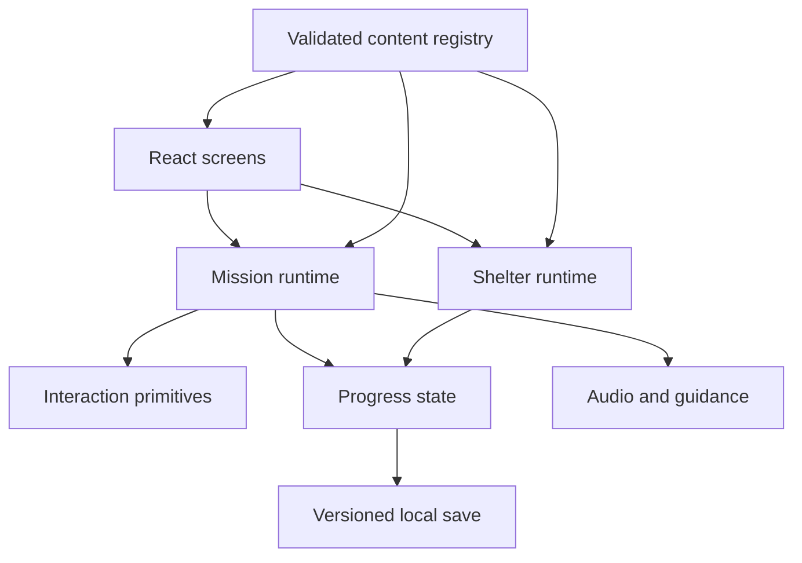

# Architecture overview

## Architectural goal

Make the player experience feel authored and cohesive while keeping implementation composable, deterministic, and content-driven. The engine owns behavior; content packs own declarations and assets.

## Technology baseline

- TypeScript with strict compiler settings
- React application shell
- Vite build and development server
- Zustand for small runtime stores
- DOM/SVG for screens and ordinary interactions
- Canvas only for pixel-oriented wipe and trace surfaces
- Web Audio API behind a small application-owned audio service
- Vitest for unit/integration tests
- Playwright for high-value browser flows and screenshot checks
- JSON Schema plus semantic validators for content

This is a web-first architecture. A later Capacitor wrapper may package the same static build, but native integration is not part of the v1.0 engine.

## Logical layers



## Runtime domains

### Application shell

Owns routing between Start, Map, Mission, Celebration, Shelter, and Parent Settings. It coordinates loading and error boundaries but does not interpret individual mission steps.

### Content registry

Discovers installed packs at build time, validates syntax and semantics, normalizes data, and exposes immutable lookup APIs. Runtime consumers receive resolved records, not raw JSON.

### Mission runtime

Loads a mission, resolves the next incomplete step, mounts the corresponding interaction implementation, handles hints, commits step completion, and emits mission completion.

### Interaction primitives

Each primitive implements a shared lifecycle:

```ts
type InteractionController = {
  start(): void;
  pause(): void;
  resume(): void;
  reset(): void;
  dispose(): void;
};
```

Concrete components receive normalized step data and emit domain events. They do not mutate global progress directly.

### Guidance and audio

Coordinates narration, effect playback, music ducking, idle timing, pulse state, and ghost-hand demonstrations. It must be deterministic under a fake clock.

### Progress and persistence

Tracks mission availability, completed missions, unlocked residents, locale, settings, and resumable in-progress state. The persistence adapter owns serialization and migration.

### Shelter

Renders content-declared areas and unlocked residents. It uses resident behaviors declared from an allowed set; it never runs pack-provided code.

## Data flow

1. Asset synchronization verifies versioned R2 objects and materializes them into each ignored local
   pack asset tree.
2. Build validation discovers pack manifests, content records, and materialized assets.
3. A generated registry references validated content and packaged local assets.
4. The app loads settings and migrates the local save if necessary.
5. The progression selector derives visible locations and missions.
6. A selected mission is normalized into a runtime plan.
7. Each completed step emits an event and updates resumable state.
8. Mission completion commits rewards idempotently before celebration.
9. Shelter selectors derive visible residents from unlocked IDs.

## Boundary rules

- React screens never parse content JSON.
- Content records never import application code.
- Interaction components do not know mission IDs.
- Persistence does not know asset URLs.
- The browser runtime resolves packaged local media and never downloads production assets from R2.
- Audio code consumes semantic cues and resolved assets, not content paths.
- A mission reward can only perform actions allowed by the reward union.
- Failed optional asset loading degrades gracefully; missing required assets fail validation before release.

## Error handling

Development and CI fail loudly on invalid content. Production shows a recoverable parent-facing error only when startup cannot construct a valid base registry. A single corrupt optional content pack may be quarantined in future versions, but v1 ships only bundled validated content.

During a mission, unexpected errors preserve the last committed step and return safely to the map after a parent-readable notice. The child is never blamed.

## Extension points

The approved extension points are:

- new content pack
- new animal or mission record conforming to existing schemas
- new location or shelter area declared by a pack
- new localization bundle
- new visual/audio assets

A new interaction primitive, executable content behavior, remote content loading, or new persistence semantics is an engine change and requires an ADR.
